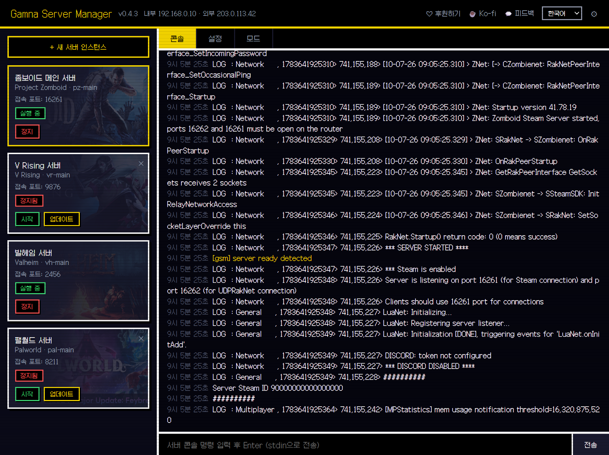
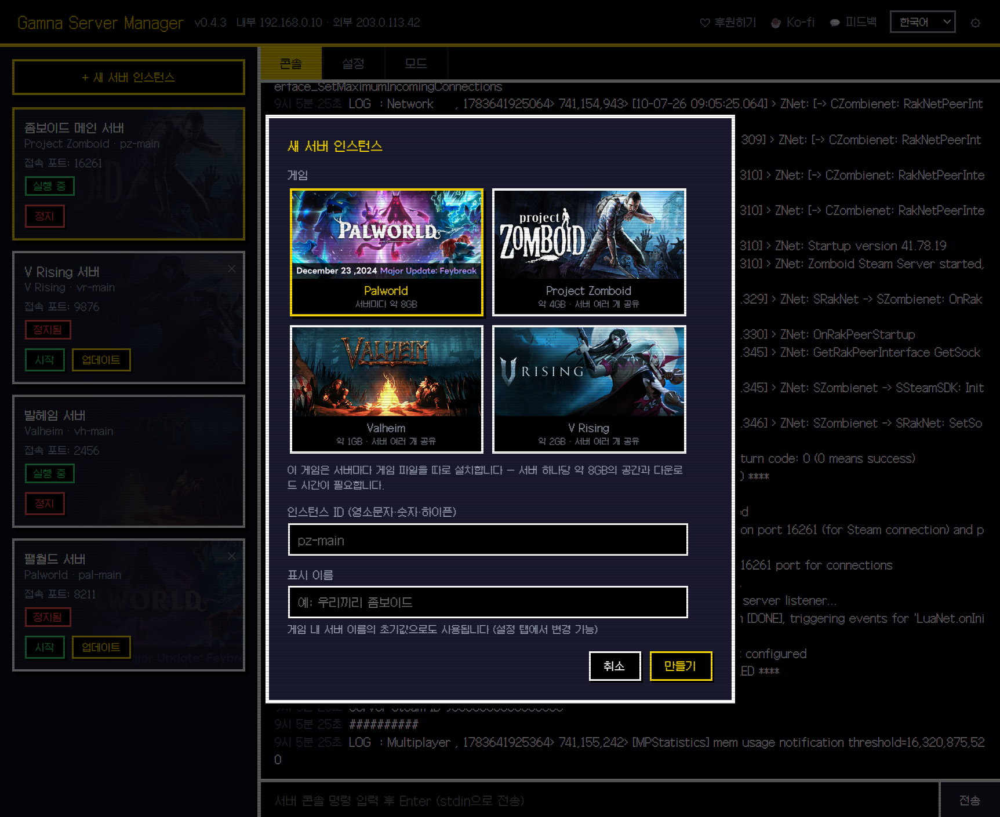
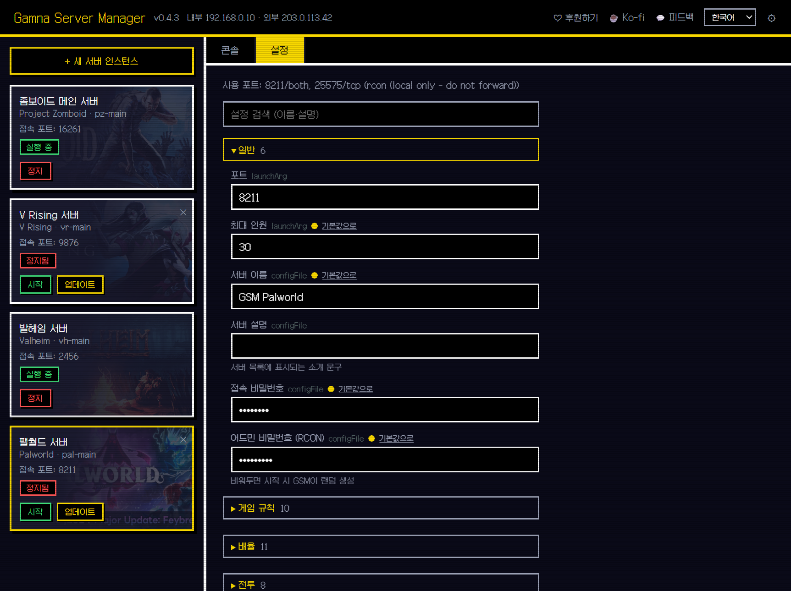
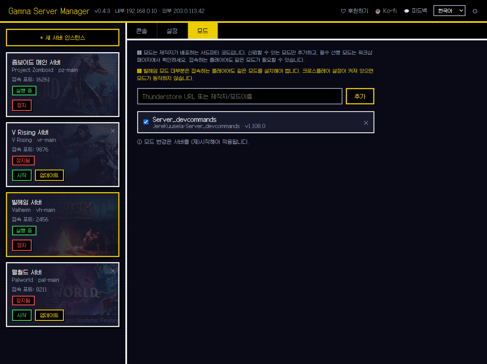

# GSM — Gamna Server Manager

[English](README.md) | **한국어**

스팀 데디케이티드 게임 서버를 웹 패널 하나로 설치·설정·시작/정지·모니터링하는 셀프호스팅 툴입니다.
SteamCMD 다운로드, 서버 설치, 설정 파일 편집, 실시간 콘솔 로그까지 — 설정 파일을 직접 열 필요가 없습니다.

> 이 저장소는 **배포 전용**입니다 (소스는 별도 관리). 실행 파일은 [Releases](../../releases)에서 받으세요.

<!-- 데모 GIF: 녹화 후 이 주석을 예:  로 교체 -->

<table>
  <tr>
    <td width="50%"></td>
    <td width="50%"></td>
  </tr>
  <tr>
    <td align="center"><em>게임만 고르면 SteamCMD가 알아서 설치합니다</em></td>
    <td align="center"><em>서버 설정 전부를 분류·검색해서 편집</em></td>
  </tr>
  <tr>
    <td colspan="2"></td>
  </tr>
  <tr>
    <td colspan="2" align="center"><em>스팀 워크샵·Thunderstore 모드를 파일 복사 없이 설치</em></td>
  </tr>
</table>

## 왜 GSM인가?

- **정말로 무료 — 등급도 유료 장벽도 없음.** 설치마다 유료 라이선스가 필요한 **AMP**나 호스팅형 **Pterodactyl**과 달리, GSM은 개인·상업 서버 호스팅 모두 무료입니다.
- **실행 파일 하나, 의존성 0.** Docker도 DB도, **Pterodactyl**이 요구하는 PHP/Node 스택도 필요 없습니다 — 받아서 실행하고 브라우저만 열면 끝.
- **새 게임은 JSON 한 장.** 게임마다 플러그인/스크립트가 필요한 **WindowsGSM**과 달리, GSM의 모든 게임은 매니페스트 한 장이라 게임이 늘어도 동작이 일관됩니다.

## 다운로드

👉 **[최신 버전 다운로드](../../releases/latest)** · [패치노트](CHANGELOG.md)

## 사용법

1. 릴리스 zip을 원하는 폴더에 압축 해제
2. `gsm.exe` 실행
3. 브라우저에서 **http://127.0.0.1:8710** 접속
4. `+ 새 서버 인스턴스` → 게임 선택 → 설치 → 시작

SteamCMD와 게임 서버 파일은 첫 설치 때 자동으로 내려받습니다.

**Windows 첫 실행 시:** GSM은 코드 서명이 되어 있지 않아, 처음 `gsm.exe`를 실행하면 윈도우가 **"Windows의 PC 보호"** SmartScreen 경고를 띄울 수 있습니다. **추가 정보 → 실행**을 누르세요.

실행 전에 파일을 직접 확인하고 싶다면 [VirusTotal](https://www.virustotal.com/gui/home/upload)에 올려 스캔할 수 있습니다.
v0.5.7 [VirusTotal 검사 결과](https://www.virustotal.com/gui/file/deb9ff9525f3f1684186de68733cf6471e1c1b970b872f2947aa7e50a877abf0)를 확인하세요. 몇몇 엔진이 잡지만, 이는 서명 없는 Go 실행파일에서 흔한 휴리스틱 오탐이며 Microsoft Defender를 비롯한 주요 엔진은 모두 통과합니다.

## 지원 게임

| 게임 | 비고 |
|---|---|
| Project Zomboid | 첫 실행 시 어드민 비밀번호 자동 설정 |
| V Rising | |
| Valheim | 크로스플레이 옵션 지원 |
| Palworld | 서버마다 게임 파일을 따로 설치 (서버당 약 8GB) — 게임이 세이브 경로 변경을 지원하지 않음 |
| Enshrouded | |
| Core Keeper | |
| Abiotic Factor | |
| Sons of the Forest | 네트워크 접근성 자가진단을 기본으로 건너뜀 — 공개 서버로 포트포워딩까지 했다면 설정에서 끄세요 |
| Soulmask | |
| ARK: Survival Ascended | 맵 선택·난이도·배율, RCON 콘솔 + 플레이어 킥/밴, CurseForge 모드 지원. 서버마다 따로 설치(약 13GB) |
| Conan Exiles | PvP/PvE·노출 수위·경험치 배율, RCON 콘솔 + 플레이어 킥/밴, 스팀 워크샵 모드 지원. 서버마다 따로 설치(약 6GB) |
| Necesse | 탑다운 협동 서바이벌/샌드박스 (번들 자바 런타임). 서버마다 따로 설치 |
| Eco | 생태계 시뮬레이션 협동 서바이벌. 기본 오프라인 모드. 서버마다 따로 설치 |
| Mordhau | 중세 대규모 PvP 검술. RCON 콘솔 + 플레이어 킥/밴. 서버마다 따로 설치(약 5GB) |
| Unturned | 좀비 서바이벌. 서버 코드로 친구 초대. 인게임 어드민으로 관리. 서버마다 따로 설치 |
| The Isle | 공룡 서바이벌 (Evrima 브랜치). 인게임 어드민으로 관리. 서버마다 따로 설치 |

RCON 콘솔이 있는 게임(**Palworld·ARK·Mordhau·Conan**)은 **플레이어** 탭이 추가됩니다 — 접속자를 보고 버튼 한 번으로 킥·밴할 수 있습니다. 명령 채널이 없는 게임은 인게임 어드민으로 관리합니다.

**Windows 전용** 데디케이티드 서버 (리눅스 빌드에서는 숨김): V Rising, Enshrouded, Core Keeper, Abiotic Factor, Sons of the Forest, Soulmask, ARK: Survival Ascended, Conan Exiles.

원하는 게임이 없다면 [게임 추가 요청](../../issues/new/choose)을 남겨주세요.

## 요구사항 / 주의사항

- Windows 10 이상 (64비트) · 리눅스 빌드 제공 (실험적 — V Rising은 리눅스 서버 없음)
- 게임 서버 파일 용량: 게임당 약 2~20GB
- 친구가 외부에서 접속하려면 공유기 포트포워딩이 필요합니다 (패널 설정 탭에 게임별 포트 표시). **v0.5.4부터 ⚙ 설정에서 UPnP를 켜면** 서버 시작 시 게임 포트를 공유기에 자동으로 열어줍니다 (공유기가 UPnP를 지원·활성화한 경우, RCON 포트는 열지 않음)
- ⚠️ **인증 기능 없음.** 패널은 **본인 PC(127.0.0.1)에서만** 접속되도록 바인딩되며 로그인이 없습니다. 패널 포트(**8710**)를 절대 포트포워딩하거나 외부에 공개하지 마세요 — 접근한 누구든 GSM이 관리하는 모든 서버를 장악할 수 있습니다. 원격 접속이 필요하면 **인증 기능이 있는 리버스 프록시**(예: Caddy/nginx + basic-auth 또는 SSO) 뒤에 두거나 **VPN**으로 접근하세요. (플레이어가 접속하는 *게임* 포트는 별개이며 포트포워딩해도 안전합니다.)

## 익명 사용 통계 (Telemetry)

v0.3.0부터 GSM은 **하루 1회 익명 핑**을 보냅니다 — 어떤 게임·언어를 우선 지원할지 판단하기 위해서입니다. 보내는 것은 아래가 전부입니다:

| 보내는 것 | 절대 보내지 않는 것 |
|---|---|
| 랜덤 익명 ID, GSM 버전, OS(윈도우/리눅스), 패널·브라우저 언어, 설치된 게임 ID, 인스턴스 수, 게임별 시작 횟수 | 서버 이름, 비밀번호, 설정값, 파일 경로, 플레이어 정보, IP 주소 (수집 서버가 접속 국가 코드만 남기고 주소는 버립니다) |

끄려면 패널 우상단 설정(⚙)에서 토글을 끄거나 `-no-telemetry` 플래그로 실행하세요.

## 피드백

버그 제보 · 게임 추가 요청 · 기능 제안은 [Issues](../../issues/new/choose)로 남겨주세요.

## 후원

GSM이 유용했다면 개발을 응원해주세요 ☕

- [GitHub Sponsors](https://github.com/sponsors/popcorn-kim93)
- [Ko-fi](https://ko-fi.com/kangnengs)

---

🤖 GSM은 AI 협업 개발([Claude](https://claude.com/claude-code) by Anthropic)로 만들어지며, 사람 개발자가 방향을 정하고 검증합니다.
