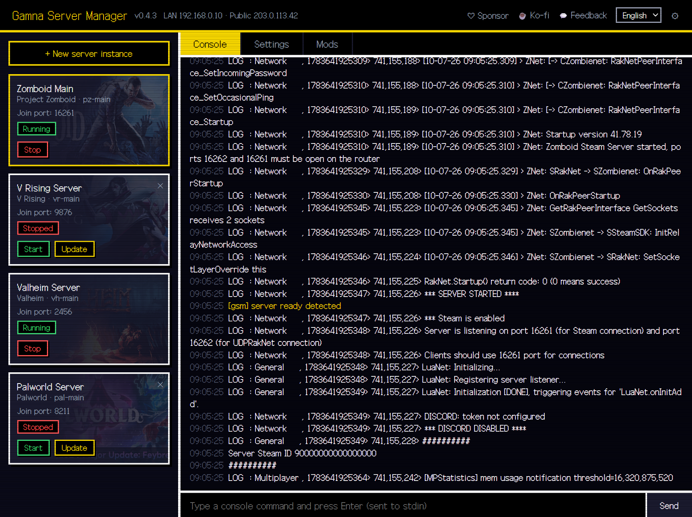
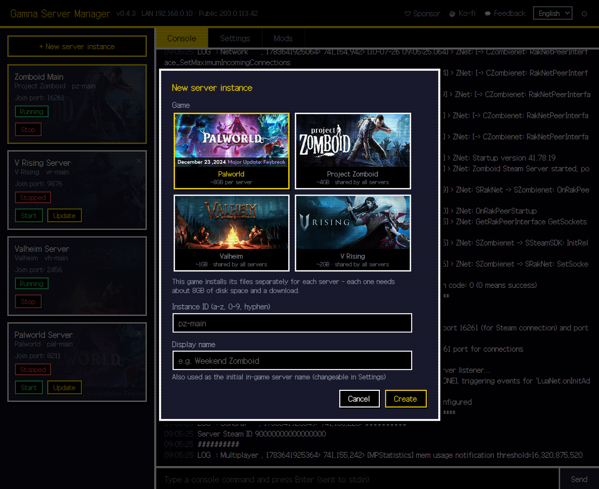
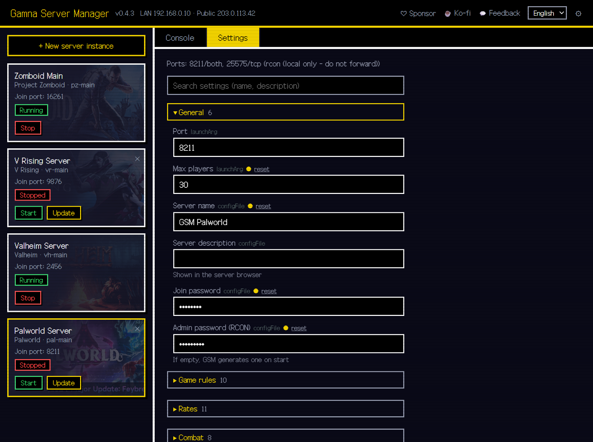
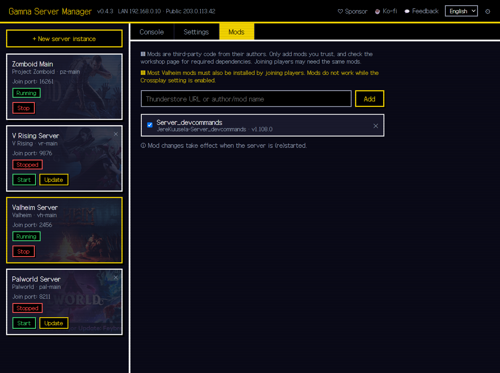

# GSM — Gamna Server Manager

**English** | [한국어](README.ko.md)

A self-hosted web panel for installing, configuring, and monitoring Steam dedicated game servers.
SteamCMD download, server installation, config editing, live console logs — all from your browser, without ever opening a config file by hand.

> This repository is **for distribution only** (source is managed separately). Grab the executable from [Releases](../../releases).

<!-- DEMO GIF: once recorded, replace this comment with e.g.  -->

<table>
  <tr>
    <td width="50%"></td>
    <td width="50%"></td>
  </tr>
  <tr>
    <td align="center"><em>Pick a game — SteamCMD does the rest</em></td>
    <td align="center"><em>Every server setting, grouped and searchable</em></td>
  </tr>
  <tr>
    <td colspan="2"></td>
  </tr>
  <tr>
    <td colspan="2" align="center"><em>Mods from Steam Workshop and Thunderstore — no manual file copying</em></td>
  </tr>
</table>

## Why GSM?

- **Actually free — no tiers, no paywall.** Unlike **AMP** (paid per-install license) or a hosted **Pterodactyl** setup, GSM is free for both personal and commercial server hosting.
- **One executable, zero dependencies.** No Docker, no database, no PHP/Node stack to stand up like **Pterodactyl** requires — download, run, open your browser.
- **New games are just a JSON file.** Where **WindowsGSM** needs a per-game plugin/script, every game in GSM is one manifest, so behavior stays consistent as games are added.

## Download

👉 **[Download the latest release](../../releases/latest)** · [Changelog](CHANGELOG.md)

## Getting Started

1. Extract the release zip anywhere you like
2. Run `gsm.exe`
3. Open **http://127.0.0.1:8710** in your browser
4. `+ New server instance` → pick a game → Install → Start

SteamCMD and game server files are downloaded automatically on first install.

**First run on Windows:** GSM isn't code-signed, so Windows may show a **"Windows protected your PC"** SmartScreen warning the first time you run `gsm.exe`. Click **More info → Run anyway**.

Prefer to check the binary first? You can scan it yourself on [VirusTotal](https://www.virustotal.com/gui/home/upload).
<!-- VIRUSTOTAL: paste the VirusTotal report URL for this release's gsm.exe here, e.g. — [VirusTotal report](https://www.virustotal.com/gui/file/<hash>) -->

## Supported Games

| Game | Notes |
|---|---|
| Project Zomboid | Admin password set automatically on first run |
| V Rising | |
| Valheim | Crossplay option supported |
| Palworld | Installs game files per server (~8GB each) — the game has no custom save-path support |
| Enshrouded | |
| Core Keeper | |
| Abiotic Factor | |
| Sons of the Forest | Public network-accessibility self-test skipped by default — turn it off in settings once you've port-forwarded a public server |
| Soulmask | |
| ARK: Survival Ascended | Map selection, difficulty/rates, RCON console; installs per server (~13GB). CurseForge mods not supported yet |

The last six ship **Windows-only** dedicated servers (hidden on the Linux build).

Want another game? File a [game request](../../issues/new/choose).

## Requirements & Notes

- Windows 10 or later (64-bit); experimental Linux build available (V Rising has no Linux server)
- Disk space: roughly 2–20 GB per game server
- For friends to join from outside, you need to port-forward on your router (per-game ports are shown in the panel's Settings tab)
- ⚠️ **No authentication.** The panel binds to **localhost (127.0.0.1) only** and has no login. Never port-forward or otherwise expose the panel port (**8710**) to the internet — anyone who can reach it can take control of every server GSM manages. For remote access, put GSM behind an **authenticating reverse proxy** (e.g. Caddy/nginx with basic-auth or an SSO provider) or reach it over a **VPN**. (The *game* ports players connect to are separate and can be forwarded safely.)

## Telemetry

Starting with v0.3.0, GSM sends **one anonymous ping per day** so development effort can go where it matters (which games, which languages). Exactly this and nothing more:

| Sent | Not sent — ever |
|---|---|
| Random anonymous ID, GSM version, OS (windows/linux), panel & browser language, installed game IDs, instance count, per-game start counts | Server names, passwords, settings values, file paths, player data, IP address (the collector derives a country code from the connection and discards the address) |

To disable, toggle it off in the panel's Settings (⚙, top right) or run with the `-no-telemetry` flag.

## Feedback

Bug reports · game requests · feature ideas → [Issues](../../issues/new/choose)

## Support the Project

If GSM saved you some pain, consider supporting development ☕

- [GitHub Sponsors](https://github.com/sponsors/popcorn-kim93)
- [Ko-fi](https://ko-fi.com/kangnengs)

---

🤖 GSM is built with AI-assisted development ([Claude](https://claude.com/claude-code) by Anthropic), directed and verified by a human developer.
